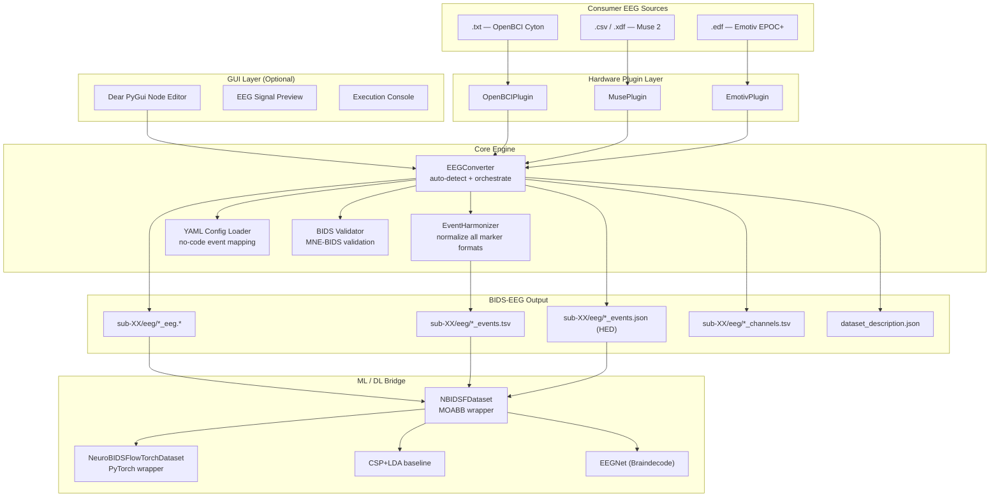

# NeuroBIDS-Flow


**Interoperable passive BCI workflows across consumer EEG sources through BIDS-EEG-based harmonization.**

Consumer EEG platforms — Muse 2, Emotiv EPOC+, OpenBCI Cyton — produce structurally incompatible output formats, making cross-device passive BCI research practically infeasible. NeuroBIDS-Flow solves this by converting heterogeneous consumer EEG recordings into a unified BIDS-EEG representation through a modular graphical framework with automated event harmonization — and bridges that output directly to ML/DL frameworks via MOABB-compatible and PyTorch Dataset wrappers.

---

## Quickstart

### 1 — Install

```bash
git clone https://github.com/Satpal26/neurobids-flow.git
cd neurobids-flow
uv pip install -e ".[dev]"
```

### 2 — Generate sample EEG files

```bash
python sample_data/generate_samples.py
```

Creates one valid sample file per supported format in `sample_data/generated/` (60s, 20 events each).

### 3 — Run a conversion

```bash
# OpenBCI Cyton
neurobids-flow convert \
  --file sample_data/generated/sample_openbci.txt \
  --bids-root ./bids_output --subject 01 --session 01 --task workload

# Muse 2 (Mind Monitor CSV)
neurobids-flow convert \
  --file sample_data/generated/sample_muse.csv \
  --bids-root ./bids_output --subject 02 --session 01 --task workload

# Emotiv EPOC+
neurobids-flow convert \
  --file sample_data/generated/sample_emotiv.edf \
  --bids-root ./bids_output --subject 03 --session 01 --task workload
```

### 4 — Run tests

```bash
uv run python -m pytest tests/ -v
```

### 5 — Run full pipeline demo (end-to-end)

```bash
python src/neurobids_flow/pipeline_demo.py
```

Runs all 6 steps: Raw EEG → BIDS+HED → MOABB → CSP+LDA + EEGNet → cross-device results (~17s).

### 6 — Use with ML frameworks

```python
from neurobids_flow import NBIDSFDataset, NeuroBIDSFlowTorchDataset

# MOABB wrapper
dataset = NBIDSFDataset(bids_root="./bids_output", task="workload")
X, y, metadata = paradigm.get_data(dataset=dataset, subjects=[1, 2])

# PyTorch wrapper
torch_ds = NeuroBIDSFlowTorchDataset(bids_root="./bids_output", task="workload")
loader = DataLoader(torch_ds, batch_size=32, shuffle=True)
```

### 7 — Launch GUI (optional)

```bash
python neurobids_gui.py
```

---

## Supported Hardware

| Device | File Format | Type | Status |
|---|---|---|---|
| InteraXon Muse 2 (Mind Monitor) | .csv | Consumer | ✅ Done |
| InteraXon Muse 2 (MuseLSL) | .xdf | Consumer | ✅ Done |
| Emotiv EPOC+ | .edf | Consumer | ✅ Done |
| OpenBCI Cyton | .txt | Consumer | ✅ Done |
| BrainProducts ActiChamp Plus | .vhdr / .vmrk / .eeg | Research | ✅ Done |
| Neuroscan NuAmps | .cnt | Research | ✅ Done |

---

## System Architecture



---

## Plugin Detection Flow


---

## EventHarmonizer — Supported Input Formats

Normalizes all consumer EEG marker types into a unified BIDS-compliant `events.tsv`:

| Input Format | Example | Source |
|---|---|---|
| LSL Markers | Lab Streaming Layer stream | Muse XDF |
| Software Strings | `eyes_open`, `workload_high` | Muse CSV, Emotiv |
| EDF Annotations | Annotation-based labels | Emotiv EDF |
| Numerical IDs | `1`, `2`, `99` | OpenBCI marker column |
| TTL Triggers | `S  1`, `S  2` | BrainProducts, Neuroscan |

Output columns: `onset | duration | trial_type | original_value | trigger_source`

---

## HED Semantic Annotation

NeuroBIDS-Flow automatically injects [Hierarchical Event Descriptors (HED)](https://www.hedtags.org) into the BIDS-EEG output when HED strings are defined in your config.

```json
{
    "trial_type": {
        "HED": {
            "rest_open":      "Sensory-event, (Eyes, Open), Rest",
            "rest_closed":    "Sensory-event, (Eyes, Closed), Rest",
            "cognitive_high": "Cognitive-effort, Task-difficulty/High"
        }
    }
}
```

---

## ML Pipeline

NeuroBIDS-Flow provides a complete passive BCI classification pipeline on top of BIDS output:

```python
# CSP + LDA baseline
from neurobids_flow.sklearn_pipeline import run_pipeline
results = run_pipeline(bids_root="./bids_output", task="workload")
# Mean accuracy: 0.526 ± 0.114 (cross-device, synthetic data)

# EEGNet deep learning
from neurobids_flow.braindecode_pipeline import run_pipeline
results = run_pipeline(bids_root="./bids_output", n_epochs=20)
# Best val accuracy: 0.545 (above chance)

# Cross-device evaluation
from neurobids_flow.cross_device_eval import run_evaluation, print_summary_table
rows = run_evaluation(bids_root="./bids_output")
print_summary_table(rows)

# Reproducible splits
from neurobids_flow.splits import generate_splits
splits = generate_splits(bids_root="./bids_output", seed=42)
# {'train': ['03', '02'], 'val': ['04'], 'test': ['01']}
```

---

## YAML Configuration

```yaml
dataset:
  name: "My Passive BCI Study"
  authors: ["Your Name"]
  institution: "Your Institution"

recording:
  task: "workload"
  power_line_freq: 50.0

event_mapping:
  "eyes_open":
    trial_type: "rest_open"
    hed: "Sensory-event, (Eyes, Open), Rest"
  "workload_high":
    trial_type: "cognitive_high"
    hed: "Cognitive-effort, Task-difficulty/High"

output:
  validate_bids: true
  overwrite: true
```

---

## Test Results

```
120 passed in 15.4s
```

| Test Module | Tests |
|---|---|
| Plugin detection (5 plugins) | 11 |
| EventHarmonizer + HED | 13 |
| Dataset description | 5 |
| MOABB wrapper | 30 |
| PyTorch Dataset wrapper | 29 |
| CSP+LDA pipeline | 8 |
| EEGNet pipeline | 7 |
| Cross-device evaluation | 7 |
| Subject splits | 8 |
| Pipeline demo | 2 |
| **Total** | **120** |

---

## Project Structure

```
neurobids-flow/
    src/neurobids_flow/
        plugins/
            base.py                  # abstract plugin interface
            brainproducts.py         # BrainProducts ActiChamp Plus
            neuroscan.py             # Neuroscan NuAmps
            openbci.py               # OpenBCI Cyton
            muse.py                  # InteraXon Muse 2
            emotiv.py                # Emotiv EPOC+
        core/
            converter.py             # pipeline orchestrator
            harmonizer.py            # event normalization + HED injection
            config.py                # YAML config loader
            validator.py             # BIDS validation
            dataset_description.py   # dataset_description.json generator
        moabb_wrapper.py             # MOABB dataset wrapper (NBIDSFDataset)
        torch_dataset.py             # PyTorch Dataset wrapper
        sklearn_pipeline.py          # CSP+LDA baseline classifier
        braindecode_pipeline.py      # EEGNet deep learning pipeline
        cross_device_eval.py         # cross-device evaluation script
        splits.py                    # reproducible train/val/test splits
        pipeline_demo.py             # full end-to-end demo
        cli.py                       # command line interface
    sample_data/
        generate_samples.py          # generates 60s sample EEG files (20 events)
    configs/
        default_config.yaml          # default configuration
        splits.json                  # reproducible subject splits (seed=42)
    tests/
        test_plugins.py              # 29 tests
        test_moabb_wrapper.py        # 30 tests
        test_torch_dataset.py        # 29 tests
        test_ml_pipeline.py          # 32 tests
```

---

## Built With

- Python 3.11
- [MNE-Python 1.11](https://mne.tools)
- [MNE-BIDS 0.18](https://mne.tools/mne-bids)
- [MOABB 1.1](https://moabb.neurotechx.com)
- [PyTorch 2.10](https://pytorch.org)
- [Braindecode 1.3](https://braindecode.org)
- [HEDTools 0.5](https://www.hedtags.org)
- [Dear PyGui](https://github.com/hoffstadt/DearPyGui)
- [uv](https://github.com/astral-sh/uv)

---

## Author

Satpal Singh — National Institute of Technology Raipur
Research Intern — NTU Singapore, BCI/CBCR Lab