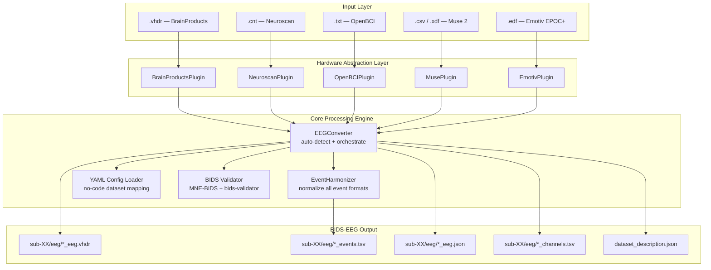
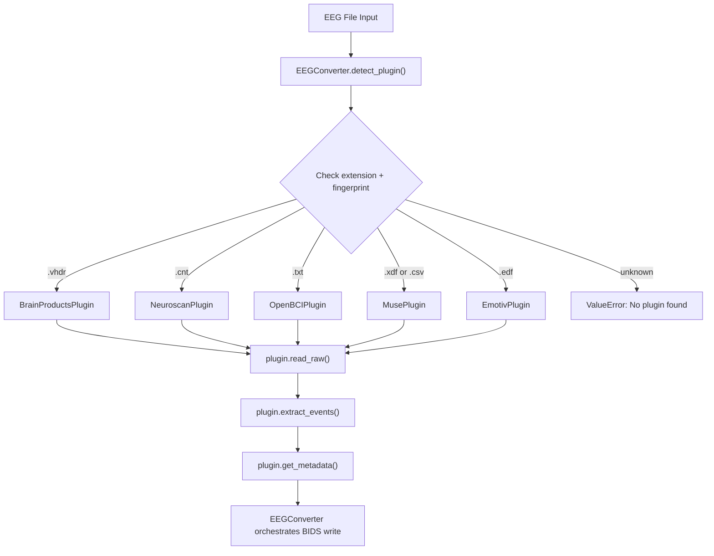
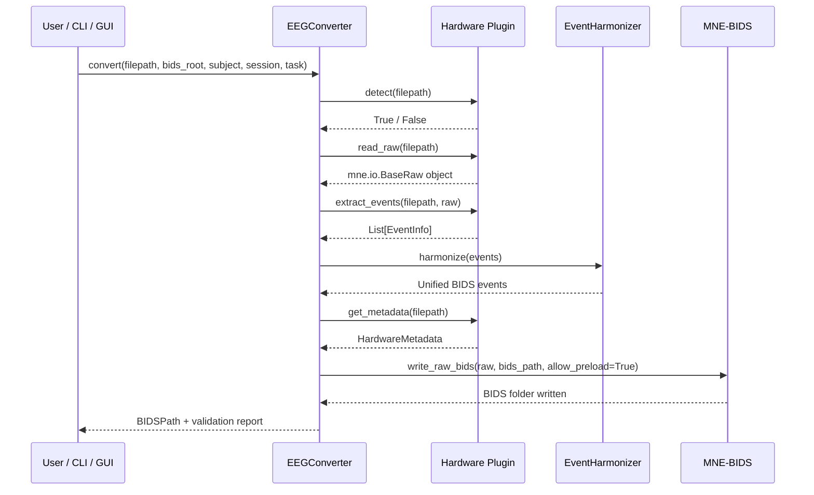

# NeuroBIDS-Flow

A modular, plugin-based Python framework for standardizing multi-source EEG recordings into BIDS-EEG format. Supports both research-grade and consumer EEG hardware through a unified graphical and command-line interface.

---

## Quickstart

### 1 — Install

```bash
git clone https://github.com/Satpal26/eeg2bids-unify.git
cd eeg2bids-unify
uv pip install -e ".[dev]"
```

### 2 — Generate sample EEG files

```bash
python sample_data/generate_samples.py
```

This creates one valid sample file per supported hardware format in `sample_data/generated/`.

### 3 — Run a conversion

```bash
# BrainProducts
eeg2bids-unify convert \
  --file sample_data/generated/sample_brainproducts.vhdr \
  --bids-root ./bids_output --subject 01 --session 01 --task ssvep

# OpenBCI
eeg2bids-unify convert \
  --file sample_data/generated/sample_openbci.txt \
  --bids-root ./bids_output --subject 02 --session 01 --task ssvep

# Muse CSV
eeg2bids-unify convert \
  --file sample_data/generated/sample_muse.csv \
  --bids-root ./bids_output --subject 03 --session 01 --task ssvep

# Emotiv
eeg2bids-unify convert \
  --file sample_data/generated/sample_emotiv.edf \
  --bids-root ./bids_output --subject 04 --session 01 --task ssvep
```

### 4 — Check output

```bash
ls bids_output/sub-01/ses-01/eeg/
```

### 5 — Run tests

```bash
uv run pytest tests/ -v
```

---

## Supported Hardware

| Hardware | File Format | Type | Status |
|---|---|---|---|
| BrainProducts ActiChamp Plus | .vhdr / .vmrk / .eeg | Research | ✅ Done |
| Neuroscan NuAmps | .cnt | Research | ✅ Done |
| OpenBCI Cyton | .txt | Consumer | ✅ Done |
| Muse 2 (Mind Monitor) | .csv | Consumer | ✅ Done |
| Muse 2 (MuseLSL) | .xdf | Consumer | ✅ Done |
| Emotiv EPOC+ | .edf | Consumer | ✅ Done |

---

## System Architecture



---

## Plugin Detection Flow



---

## BIDS Conversion Pipeline



---

## EventHarmonizer — Supported Input Formats

The EventHarmonizer normalizes all raw event marker types into a unified BIDS-compliant `events.tsv`:

| Input Format | Example | Source |
|---|---|---|
| TTL Triggers | `S  1`, `S  2`, `S 99` | BrainProducts, Neuroscan |
| Numerical IDs | `1`, `2`, `99` | OpenBCI marker column |
| LSL Markers | Lab Streaming Layer stream | Muse XDF |
| Software Strings | `stimulus_6hz`, `rest` | Muse CSV, Emotiv |
| EDF Annotations | Annotation-based labels | Emotiv EDF |

Output columns: `onset | duration | trial_type | original_value | trigger_source`

---

## YAML Configuration

No source-code changes needed between datasets. Edit `configs/default_config.yaml`:

```yaml
dataset_name: "My EEG Study"
task_label: ssvep
power_line_freq: 50

event_mapping:
  "S  1": stimulus_6hz
  "S  2": stimulus_8hz
  "99":   rest

output:
  validate_bids: true
  overwrite: true
```

---

## Test Results

```
19 passed in 3.92s
```

All 5 hardware plugins validated. End-to-end BIDS conversion tested across all supported formats — all passing MNE-BIDS validation.

---

## Project Structure

```
eeg2bids-unify/
    src/eeg2bids_unify/
        plugins/
            base.py              # abstract plugin interface
            brainproducts.py     # BrainProducts ActiChamp Plus
            neuroscan.py         # Neuroscan NuAmps
            openbci.py           # OpenBCI Cyton
            muse.py              # InteraXon Muse 2
            emotiv.py            # Emotiv EPOC+
        core/
            converter.py         # pipeline orchestrator
            harmonizer.py        # event normalization
            config.py            # YAML config loader
            validator.py         # BIDS validation
        cli.py                   # command line interface
    sample_data/
        generate_samples.py      # generates sample EEG files for all formats
        generated/               # gitignored — generated locally
    configs/
        default_config.yaml      # default configuration
    tests/
        test_plugins.py          # 19 tests
```

---

## Built With

- Python 3.11
- [MNE-Python 1.11](https://mne.tools)
- [MNE-BIDS 0.18](https://mne.tools/mne-bids)
- [Dear PyGui](https://github.com/hoffstadt/DearPyGui) — GUI frontend
- [uv](https://github.com/astral-sh/uv) — package manager

---

## Author

Satpal — B.Tech Biomedical Engineering, NIT Raipur