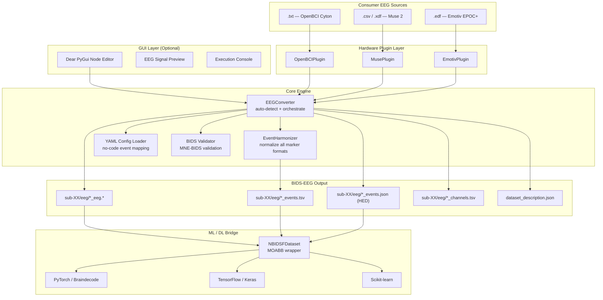
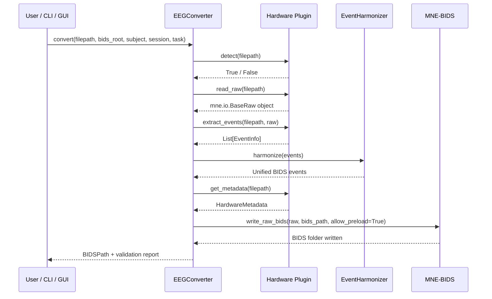

# NeuroBIDS-Flow


**Interoperable passive BCI workflows across consumer EEG sources through BIDS-EEG-based harmonization.**

Consumer EEG platforms — Muse 2, Emotiv EPOC+, OpenBCI Cyton — produce structurally incompatible output formats, making cross-device passive BCI research practically infeasible. NeuroBIDS-Flow solves this by converting heterogeneous consumer EEG recordings into a unified BIDS-EEG representation through a modular graphical framework with automated event harmonization — and bridges that output directly to ML/DL frameworks via a MOABB-compatible dataset wrapper.

---

## Quickstart

### 1 — Install

```bash
git clone https://github.com/Satpal26/neurobids-flow.git
cd neurobids-flow
uv pip install -e ".[dev]"
```

### 2 — Generate sample EEG files

```bash
python sample_data/generate_samples.py
```

Creates one valid sample file per supported format in `sample_data/generated/`.

### 3 — Run a conversion

```bash
# OpenBCI Cyton
neurobids-flow convert \
  --file sample_data/generated/sample_openbci.txt \
  --bids-root ./bids_output --subject 01 --session 01 --task workload

# Muse 2 (Mind Monitor CSV)
neurobids-flow convert \
  --file sample_data/generated/sample_muse.csv \
  --bids-root ./bids_output --subject 02 --session 01 --task workload

# Emotiv EPOC+
neurobids-flow convert \
  --file sample_data/generated/sample_emotiv.edf \
  --bids-root ./bids_output --subject 03 --session 01 --task workload
```

### 4 — Check output

```bash
ls bids_output/sub-01/ses-01/eeg/
```

### 5 — Run tests

```bash
uv run python -m pytest tests/ -v
```

### 6 — Use with ML frameworks (MOABB wrapper)

```python
from neurobids_flow.moabb_wrapper import NBIDSFDataset

# Load your BIDS dataset
dataset = NBIDSFDataset(bids_root="./bids_output", task="workload")

# Plug into any MOABB paradigm → get ML-ready arrays instantly
X, y, metadata = paradigm.get_data(dataset=dataset, subjects=[1, 2])
print(X.shape)   # (n_trials, n_channels, n_times)
```

### 7 — Launch GUI (optional)

```bash
python neurobids_gui.py
```

---

## Supported Hardware

| Device | File Format | Type | Status |
|---|---|---|---|
| InteraXon Muse 2 (Mind Monitor) | .csv | Consumer | ✅ Done |
| InteraXon Muse 2 (MuseLSL) | .xdf | Consumer | ✅ Done |
| Emotiv EPOC+ | .edf | Consumer | ✅ Done |
| OpenBCI Cyton | .txt | Consumer | ✅ Done |
| BrainProducts ActiChamp Plus | .vhdr / .vmrk / .eeg | Research | ✅ Done |
| Neuroscan NuAmps | .cnt | Research | ✅ Done |

---

## System Architecture



---

## Plugin Detection Flow


---

## BIDS Conversion Pipeline



---

## EventHarmonizer — Supported Input Formats

Normalizes all consumer EEG marker types into a unified BIDS-compliant `events.tsv`:

| Input Format | Example | Source |
|---|---|---|
| LSL Markers | Lab Streaming Layer stream | Muse XDF |
| Software Strings | `eyes_open`, `workload_high` | Muse CSV, Emotiv |
| EDF Annotations | Annotation-based labels | Emotiv EDF |
| Numerical IDs | `1`, `2`, `99` | OpenBCI marker column |
| TTL Triggers | `S  1`, `S  2` | BrainProducts, Neuroscan |

Output columns: `onset | duration | trial_type | original_value | trigger_source`

---

## HED Semantic Annotation

NeuroBIDS-Flow automatically injects [Hierarchical Event Descriptors (HED)](https://www.hedtags.org) into the BIDS-EEG output when HED strings are defined in your config.

**What gets generated automatically:**

| File | Content |
|---|---|
| `*_events.tsv` | `onset \| duration \| trial_type \| value \| trigger_source` |
| `*_events.json` | HED string dictionary mapped to each `trial_type` |
| `dataset_description.json` | `"HEDVersion": "8.2.0"` injected automatically |

**Example `events.json` sidecar output:**
```json
{
    "trial_type": {
        "HED": {
            "rest_open":      "Sensory-event, (Eyes, Open), Rest",
            "rest_closed":    "Sensory-event, (Eyes, Closed), Rest",
            "cognitive_high": "Cognitive-effort, Task-difficulty/High"
        }
    }
}
```

This makes NeuroBIDS-Flow output fully FAIR-compliant — datasets are ready for cross-device mega-analyses and generalized passive BCI model training without any additional annotation steps.

---

## MOABB Dataset Wrapper

NeuroBIDS-Flow includes a built-in MOABB-compatible dataset wrapper (`NBIDSFDataset`) that bridges BIDS+HED output directly to ML/DL frameworks — without duplicating or reformatting any data.

```python
from neurobids_flow.moabb_wrapper import NBIDSFDataset

# Initialise — auto-detects subjects and sessions from BIDS root
dataset = NBIDSFDataset(bids_root="./bids_output", task="workload")

# Use with any MOABB paradigm
X, y, metadata = paradigm.get_data(dataset=dataset, subjects=[1, 2])
print(X.shape)   # (n_trials, n_channels, n_times)

# Binary cognitive workload classification
dataset = NBIDSFDataset(
    bids_root="./bids_output",
    events={"cognitive_low": 0, "cognitive_high": 1},
    interval=[0.0, 4.0],
)
```

**Compatible frameworks:**

| Framework | Usage |
|---|---|
| MOABB | Benchmark against EEGNet, ShallowFBCSP, Riemannian classifiers |
| Braindecode (PyTorch) | `MOABBDataset(dataset_name="NBIDSF", subject_ids=[1])` |
| TorchEEG | Pass MNE Epochs from `paradigm.get_data()` to `MNEEpochsDataset` |
| TensorFlow / Keras | Inject NumPy arrays `X, y` directly into `tf.data.Dataset` |
| Scikit-learn | SVM, LDA, Riemannian geometry classifiers |

**Supported passive BCI events:**

| Category | trial_type values |
|---|---|
| Resting state | `rest_open`, `rest_closed`, `rest` |
| Cognitive workload | `cognitive_low`, `cognitive_high`, `fatigue`, `alert` |
| Emotion | `emotion_positive`, `emotion_negative`, `arousal_high`, `arousal_low` |

---

## YAML Configuration

No source-code changes needed between datasets. Edit `configs/default_config.yaml`:

```yaml
dataset:
  name: "My Passive BCI Study"
  authors: ["Your Name"]
  institution: "Your Institution"

recording:
  task: "workload"
  power_line_freq: 50.0

event_mapping:
  "eyes_open":
    trial_type: "rest_open"
    hed: "Sensory-event, (Eyes, Open), Rest"
  "workload_high":
    trial_type: "cognitive_high"
    hed: "Cognitive-effort, Task-difficulty/High"
  "99": "rest"

output:
  validate_bids: true
  overwrite: true
```

---

## Test Results

```
59 passed in 5.13s
```

All plugins validated. End-to-end BIDS conversion tested across consumer EEG formats. MOABB wrapper tested with 30 unit tests. All passing MNE-BIDS validation.

---

## Project Structure

```
neurobids-flow/
    src/neurobids_flow/
        plugins/
            base.py              # abstract plugin interface
            brainproducts.py     # BrainProducts ActiChamp Plus
            neuroscan.py         # Neuroscan NuAmps
            openbci.py           # OpenBCI Cyton
            muse.py              # InteraXon Muse 2
            emotiv.py            # Emotiv EPOC+
        core/
            converter.py         # pipeline orchestrator
            harmonizer.py        # event normalization + HED injection
            config.py            # YAML config loader
            validator.py         # BIDS validation
        cli.py                   # command line interface
        moabb_wrapper.py         # MOABB dataset wrapper (NBIDSFDataset)
    sample_data/
        generate_samples.py      # generates sample EEG files for all formats
        generated/               # gitignored — generated locally
    configs/
        default_config.yaml      # default configuration
    tests/
        test_plugins.py          # 29 tests — plugins, harmonizer, HED, dataset description
        test_moabb_wrapper.py    # 30 tests — MOABB wrapper
```

---

## Built With

- Python 3.11
- [MNE-Python 1.11](https://mne.tools)
- [MNE-BIDS 0.18](https://mne.tools/mne-bids)
- [MOABB 1.1](https://moabb.neurotechx.com) — BCI benchmarking framework
- [HEDTools 0.5](https://www.hedtags.org) — Hierarchical Event Descriptors
- [Dear PyGui](https://github.com/hoffstadt/DearPyGui) — GUI frontend
- [uv](https://github.com/astral-sh/uv) — package manager

---

## Author

Satpal Singh — National Institute of Technology Raipur
Research Intern — NTU Singapore, BCI/CBCR Lab