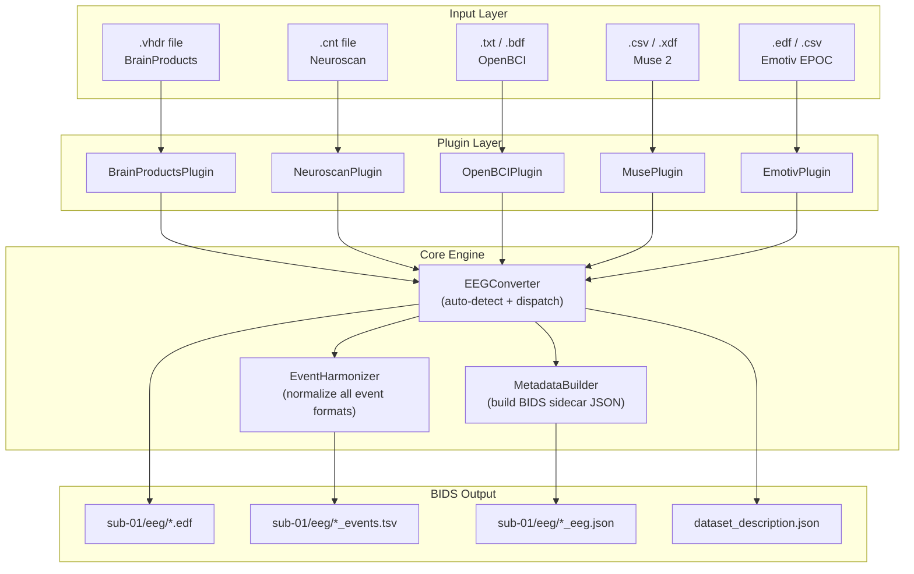
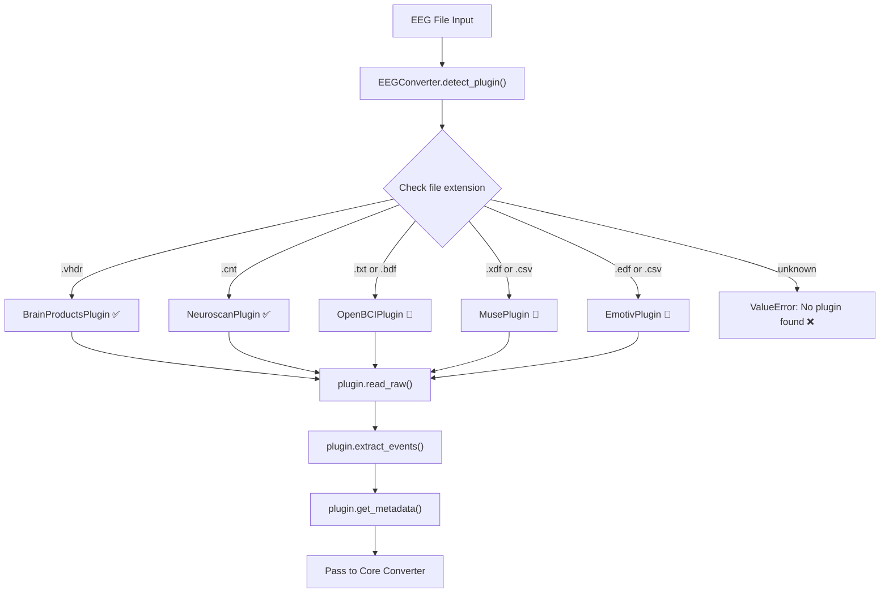
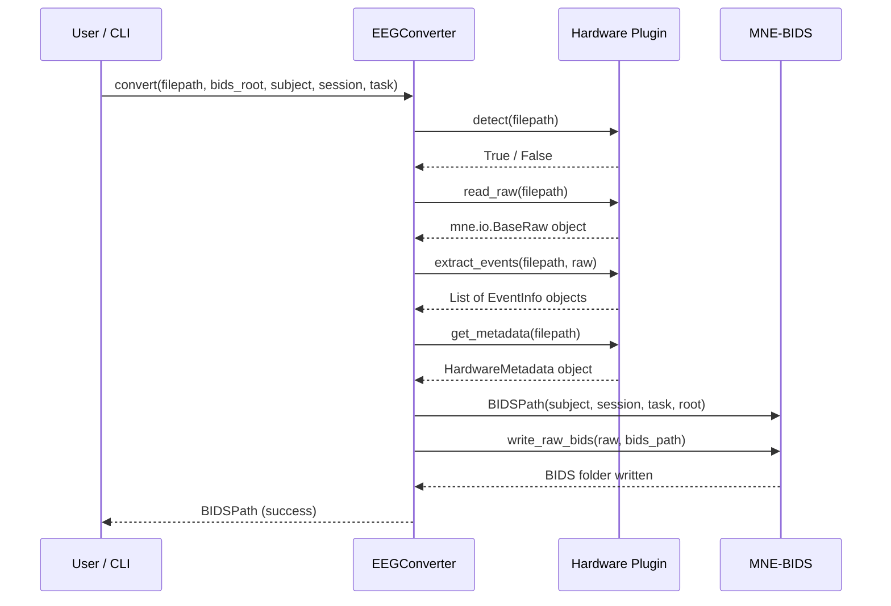

# eeg2bids-unify

A plugin-based Python tool for converting heterogeneous EEG hardware files into BIDS-EEG format.

Built for NTU Singapore BCI Lab — Target 1 of the SSVEP research roadmap.

---

## System Architecture


---

## Plugin Detection Flow


---

## BIDS Conversion Pipeline


---

## Supported Hardware

| Hardware | File Format | Status |
|---|---|---|
| BrainProducts ActiChamp Plus | .vhdr / .vmrk / .eeg | ✅ Done |
| Neuroscan NuAmps | .cnt | ✅ Done |
| OpenBCI Cyton | .txt / .bdf | ✅ Done |
| Muse 2 | .csv / .xdf | ✅ Done |
| Emotiv EPOC+ | .edf / .csv | ✅ Done |

## Test Results
```
19 passed in 3.92s
```

## Project Structure
```
src/eeg2bids_unify/
    plugins/
        base.py            # abstract plugin interface
        brainproducts.py   # BrainProducts ActiChamp
        neuroscan.py       # Neuroscan NuAmps
        openbci.py         # OpenBCI Cyton
        muse.py            # InteraXon Muse 2
        emotiv.py          # Emotiv EPOC+
    core/
        converter.py       # main conversion engine
        harmonizer.py      # event normalization
        config.py          # YAML config loader
        validator.py       # BIDS validation
    cli.py                 # command line interface
configs/
    default_config.yaml    # default configuration
tests/
    test_plugins.py        # 19 tests
```


## Built With
- Python 3.11
- MNE-Python 1.11
- MNE-BIDS 0.18
- uv (package manager)

